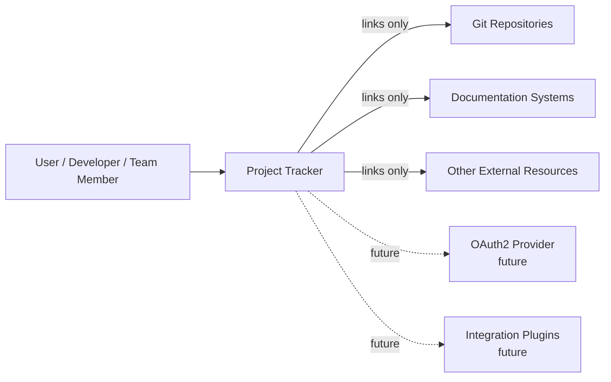
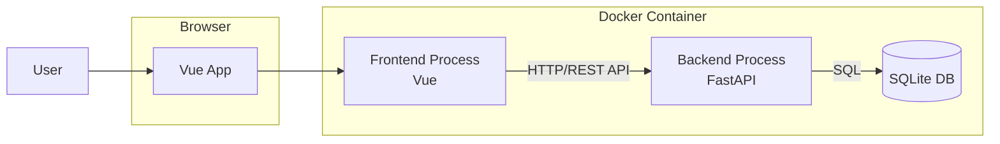
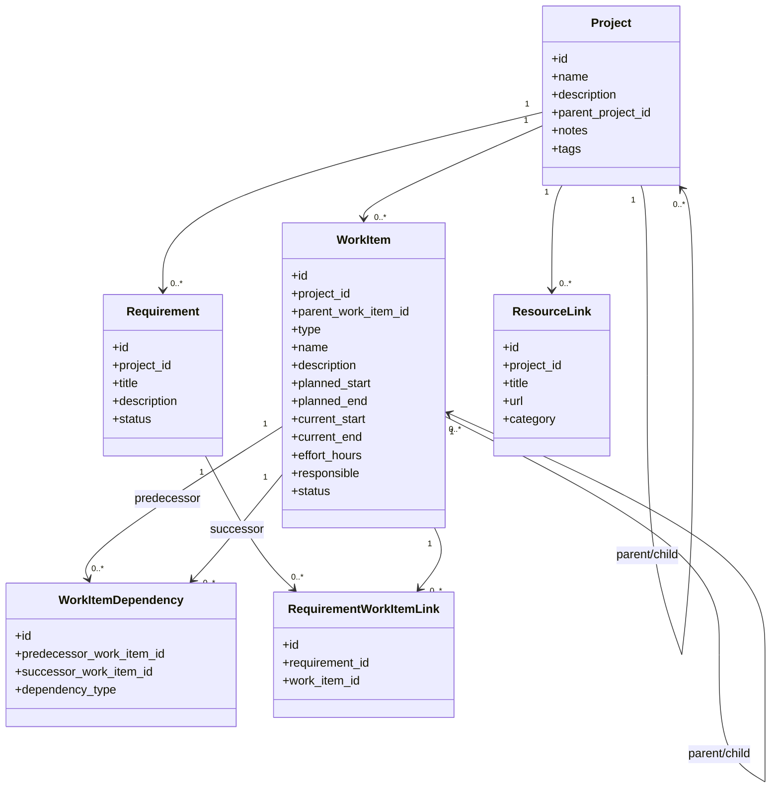
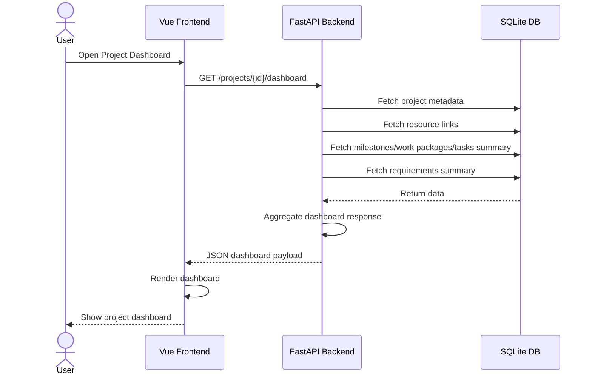

## 1. System Context Diagram

### Purpose

Shows how `project-tracker` interacts with users and external systems.

---

## 2. Container Diagram

### Purpose

Shows internal runtime structure and communication.

### Key Decisions Reflected

* Separate frontend and backend processes
* Single container deployment in v1
* SQLite embedded for v1

---

## 3. Domain Model Diagram

### Purpose

Defines the core data model and relationships in a more abstract way.

### Key Design Decisions Reflected

* project hierarchy via `parent_project_id`
* abstract `WorkItem` model
* `Milestone`, `WorkPackage`, and `Task` are work item types
* dependencies are modeled uniformly between work items
* requirements are separate from planning, but may link to both projects and work items

---

# Recommended interpretation

## `WorkItem.type`

Use an enum-like field:

* `milestone`
* `work_package`
* `task`

That keeps the data model flexible while still allowing specialized logic in backend services and frontend views.

## `parent_work_item_id`

Use this for containment/hierarchy between work items.

This allows:

* milestone → work package
* work package → task
* milestone → task, if needed
* future extensions, if your model evolves

You may still enforce business rules later so not every combination is allowed.

## `WorkItemDependency`

This cleanly expresses:

* any work item may have 0..* predecessors
* any work item may have 0..* successors

That matches your real-world dependency requirement much better than separate dependency handling by entity type.

## `RequirementWorkItemLink`

This keeps requirements separate from planning while allowing traceability.

So a requirement can be linked to:

* its project directly
* optionally one or more work items

---

## 4. Sequence Diagram — Open Project Dashboard

### Purpose

Shows how data flows when a user opens a project dashboard.

