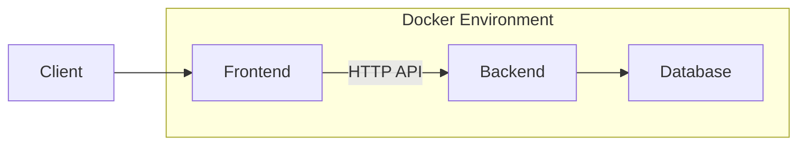
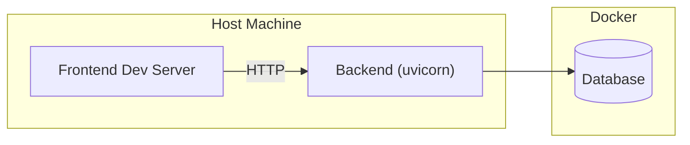
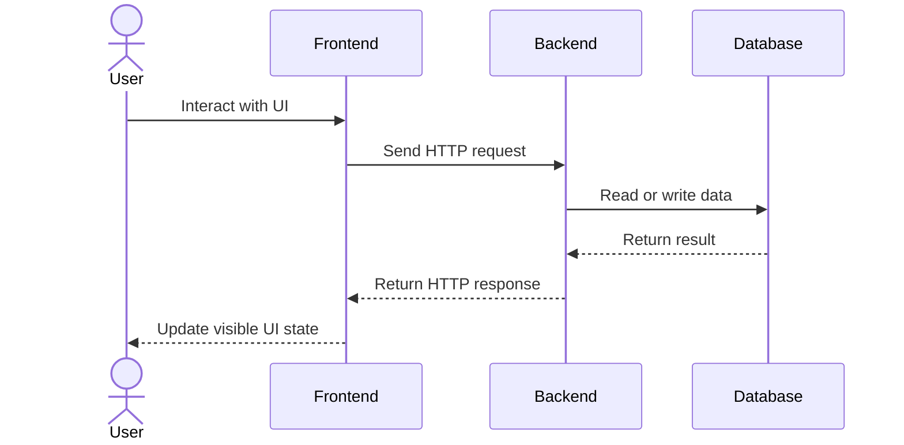

## High-Level Architecture

---

## Components

### Frontend

- Runs as a separate development server
- Provides user interface
- Communicates with backend via HTTP API
- Uses generated API client based on OpenAPI

Responsibilities:

- presentation
- user interaction
- UI state

---

### Backend

- FastAPI application
- Exposes REST API
- Implements business logic
- Handles persistence

Responsibilities:

- request validation
- application logic
- domain logic
- database access

---

### Database

- Relational database
- Used for persistent storage

Responsibilities:

- store structured project data
- support relationships between entities

---

## Development Runtime Model

In development, components run separately:

- Docker Compose:
    - database and infrastructure
- Backend:
    - local process (`uvicorn`)
- Frontend:
    - local dev server (`vite`)

---

## Communication Flow

---

## API Integration

- Backend exposes OpenAPI schema
- Frontend uses generated client
- API is the single integration boundary

Implications:

- no shared business logic between frontend and backend
- contract must remain stable
- changes require client regeneration

---

## Deployment Considerations (Planned)

Future deployment may include:

- separate containers for frontend and backend
- reverse proxy (routing, TLS)
- external database
- authentication layer
